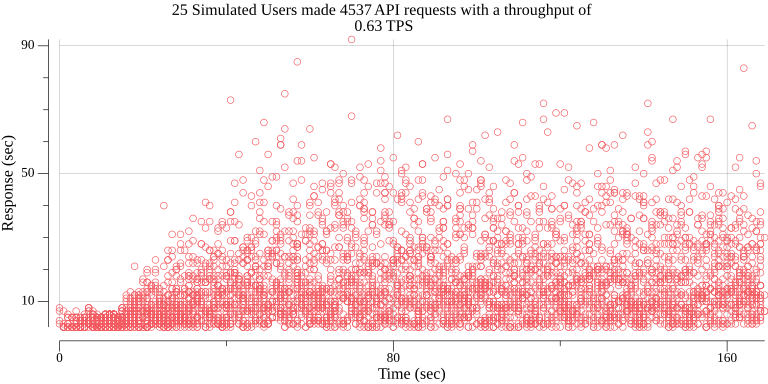

# Keyhole Software Load Testing Utility

This command Line utility, written in [Go](https://go.dev),  load tests APIs against specified simulated users. 
It can generate throughput statistics and performance Graphs. 

## Running 

1. Clone Repository 

2. Open a command line in cloned directory and execute one of the following:

###### macOs Intel

```
    ./bin/macOs/khsload do https://<an address> --users 10 --duration 30 
```

*Note: we currently supply only macOs Intel pre-built targets in this repository. 
Follow the __Installation and Running from Source__ section below to create an executable 
binary for other environemnts* 


3. The console displays results output 

## Command Line Flags 

Use the following command line flags to configure your load test. 
You can define options in a `YAML` config file as well. Reference: 

```
    --duration      Int      Number of seconds to run test
    --users         Int      Number of users to simulate 
    --ramp          Int      Number of seconds between starting users
    --wait          Int      Number of seconds to wait between requests 
    --sla           Int      Number of milliseconds limit used to report excessive transaction duration  
    --config        string   YAML config file see YAML Config section below
    --save          string   Save results to CSV file
    --replace       string   Save and replace file if exists results to CSV file
    --contenttype   string   Type (e.g. application/json) for POSTING data
    --authtoken     string   Authorization token 
    --tokentemplate string   Expression to format authtoken in request header
```
## Installing and Running from Source Code

1. [Install Go](https://go.dev/doc/install) 

2. Clone Repo 

3. Open a command line terminal, navigate to the repo directory, and then enter these commands:

```
    go install
    go build  
```

That will create an executable named `khsload` in your directory. 
Execute it with this command: 

```
    ./khsload 
```
See previous sections for options.

## Plotting Results 

You can plot in a scatter graph saved to a `CSV` file.  

**Run a Load test saved to `test.csv` by using the following command:**

```
    ./khsload do https://<an address> --users 4 --duration 20 --save test.csv 
```

**Generate a plot from the generated `test.csv`**

```
    ./khsload plot test.csv
```

That command creates a scatter-based graph in a file named `khsplot.png`. The heading 
shows the number of users, the total requests, along with the TPS value.

Example PLOT graph:



**Generate a SLA graph from the generated `test.csv`**

```
    ./khsload sla test.csv
```

That command creates a line graph of response times vs time offset in a file named `khssla.png`. 
The heading shows the nnumber of requests, and users, as well as the count of responses that exceed the SLA limit.

Example SLA graph:


### Configuration YAML 

Instead of supplying command line flags, you can define test options in a `YAML` configuration file
by specifing file path in a `--config` flag. 

An example YAML file...
```
#
# Number of Users to Simulate 
#
users: 25
#
# Seconds to wait while ramping us users
#
ramp: 2
#
# Seconds to run the API load test
#
duration: 120
#
# Secconds to wait inbetween API requests
#
wait: 1
#
# Template used to apply token to API request Headers
#
#
# Service level agreement in Milliseconds (reports transaction that  #exceeds this number)
#
sla: 1000
tokentemplate: "Bearer {{.}}"
#
# POST content type default is application/json
#
contenttype: "application/x-www-form-urlencoded"
#
# URL required to obtain an authorization Token
#
# 
auth:
  url: https://<authenticate URL>
  userid: xxxxx
  password: xxxxx
  tokenizeusing: ","
  gettoken: "token"
  splitwith: ":"
#
# URL's to load test
#
url:
  - POST~<URL>~key=value&key2=value2
  - GET~<URL>

```
## POST Requests 
HTTP GET is the default request method. Prefix the URL with `POST~` to carry 
out an HTTP POST request, as shown here:

```
    ./khsload do "POST~http://<Your POST Address Here>~{key1: value, key2: value}"
``` 
Content type of `POST` data defaults to `application/json`.
Supply JSON as an object literal after the address tilde `~`.

You may chnage the content type to `application/x-www-form-urlencoded` using a `--contenttype` flag:

```
    ./khsload do "POST~https://<Your POST Address Here>~akey1=avalue&akey2=avalue" --contenttype application/x-www-form-urlencoded
```

## Token Based Authentication 
This utility supports load testing `TOKEN`-based authentication schemes. 
If an API has a persistent access token applicable to request headers,
you can specify it using the command line `--authtoken` flag (or define it in the `YAML` config). 

```
    ./khsload do <some url> --authtoken <auth token>
```

Tokens apply to request headers using the `tokentemplate` expression. 
This appies the token value to an `authorization` request `Header` field. 

``` 
    ./khsload do <some url> --authtoken <auth token> --tokentemplate "{{Bearer .}}"
```

## Credentialed Auth Token 
If a authorization token is required via an authentication api call. You can specify the following configuraiton in a YAML config file as shown below.

```
auth:
  url: https://<authenticate URL>
  userid: xxxxx
  password: xxxxx
  tokenizeusing: ","
  gettoken: "token"
  splitwith: ":"
```

An authentication url is specified that will accept a user id an password values.  It assummes a stringfied JSON result with a token id that is ia JSON key value parameter. You can specify the key value using the `gettoken` value and the keys value is obtained by splitting this value with the `tokenusing` configuration value. 

So considering the configuration above the utility will obtain an auth token that will be used for api calls to load test.  The Auth URL will be invoked with this call. 

```
http://<authenticate URL>  POST as application/JSON -> userid: xxxx password: xxxx 
```

A resulting JSON string will be returned as follows 

```
   { key1: ffdff,  token: abcdefh , key2: ddddddd }
```

The config will extract the token value from the string and use it as an authorization token


